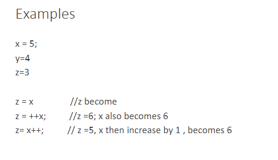

# Topic 2

## [Document to refer](../School%20Notes/Topic%202%20Operators%20&%20Selections(I)v1.pdf)

### Table of contents listed below:
1. [Constrains](#Constrains) 
2. [Operators](#Operators)
3. [Use of remainder operator (%)](#Roperator)
4. [Shorthand Operators](#Short)


<h2 id ="Constrains" > Constrants
<h4>

>Represents permanent values
    >> eg pi = 3.14159

- 3 Benefits:
    - 1. Improves readability
    - 2. Improves maintainability
    - 3. Improves reliability

- Syntax:
    - const data_type constant_name = value;

- Example:
    - const int PI = 3.14159;


<h2 id="Operators"> Operators
<h4>

Operators are used to perform operations on variables and values.


- Numeric Operators
    - +, -, *, /, %, ++, --

- Relational Operators
    - ==, !=, >, <, >=, <=

- Logical Operators
    - &&, ||, !

- Bitwise Operators
    - &, |, ^, ~, <<, >>

- Assignment Operators
    - =, +=, -=, *=, /=, %=, <<=, >>=, &=, ^=, |=


<h2 id= Roperator> Use of remainder operator (%)
<h4>

> To determine whether a number is even or odd, use the remainder operator (%). If the remainder is 0, the number is even; otherwise, it is odd.

- an even number %2 is always 0
- an odd number %2 is always 1

> To determine whether a number is divisible by another number, use the remainder operator (%). If the remainder is 0, the number is divisible by the other number; otherwise, it is not divisible.

- e.g Result of 67 % 5 is 2, but 65% 5 is 0

So if a numver % 5 is 0 ---> it is divisible by 5


<h2 id="Short"> Shorthand Operators

<h4>

 +=, -=, *=, /=, %=, <<=, >>=, &=, ^=, |=
 
-------------------------
Example:

``` javascript
var x = 5;
x += 5; // x = x + 5
console.log(x); //10
```


Increment and Decrement Operators

- ++, --

``` javascript
var x = 5;
x++; // x = x + 1
console.log(x); //6
```


Example 

``` javascript
x = 5;
y = 4;
z = 3;

z = x // 5
x ++= y // 9
y = z // 5
```



What is this output
    
``` javascript
    a = 2; // a = 2
    a= a++ + a; // a = 2 + 3
    console.log(a); // 5

    //explaination: why is a 3 and not 2?
    // a++ is 2, but a is 3
    
```


``` javascript
   b =2;
   b = b + b++; // b = 2 + 2
    console.log(b); // 4
    //explaination: b++ is 2, but b is 4
``` 
