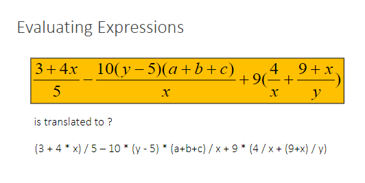

# Topic 2

## [Document to refer](../School%20Notes/Topic%202%20Operators%20&%20Selections(I)v1.pdf)

### Table of contents listed below:
1. [Constrains](#Constrains) 
2. [Operators](#Operators)
3. [Use of remainder operator (%)](#Roperator)
4. [Shorthand Operators](#Short)


<h2 id ="Constrains" > Constrants
<h4>

>Represents permanent values
    >> eg pi = 3.14159

- 3 Benefits:
    - 1. Improves readability
    - 2. Improves maintainability
    - 3. Improves reliability

- Syntax:
    - const data_type constant_name = value;

- Example:
    - const int PI = 3.14159;


<h2 id="Operators"> Operators
<h4>

Operators are used to perform operations on variables and values.


- Numeric Operators
    - +, -, *, /, %, ++, --

- Relational Operators
    - ==, !=, >, <, >=, <=

- Logical Operators
    - &&, ||, !

- Bitwise Operators
    - &, |, ^, ~, <<, >>

- Assignment Operators
    - =, +=, -=, *=, /=, %=, <<=, >>=, &=, ^=, |=


<h2 id= Roperator> Use of remainder operator (%)
<h4>

> To determine whether a number is even or odd, use the remainder operator (%). If the remainder is 0, the number is even; otherwise, it is odd.

- an even number %2 is always 0
- an odd number %2 is always 1

> To determine whether a number is divisible by another number, use the remainder operator (%). If the remainder is 0, the number is divisible by the other number; otherwise, it is not divisible.

- e.g Result of 67 % 5 is 2, but 65% 5 is 0

So if a numver % 5 is 0 ---> it is divisible by 5




<h2 id="Short"> Shorthand Operators

<h4>

 +=, -=, *=, /=, %=, <<=, >>=, &=, ^=, |=

-------------------------
Example:

``` javascript
var x = 5;
x += 5; // x = x + 5
console.log(x); //10
```


Increment and Decrement Operators

- ++, --

``` javascript
var x = 5;
x++; // x = x + 1
console.log(x); //6
```


Example 

``` javascript
x = 5;
y = 4;
z = 3;

z = x // 5
x ++= y // 9
y = z // 5
```


What is this output
    
``` javascript
a = 2; // a = 2
a= a++ + a; // a = 2 + 3
console.log(a); // 5

//explaination: why is a 3 and not 2?
// a++ is 2, but a is 3
    
```


``` javascript
b =2;
b = b + b++; // b = 2 + 2
console.log(b); // 4
//explaination: b++ is 2, but b is 4
``` 

<h2 id="Bool"> Boolean Operators

<h4>

| Operator | Description |
|----------|-------------|
| !        | Not         |
| &&       | And         |
| \|\|     | Or          |


| Operator | Description |
|----------|-------------|
| &&       | Logical AND |
| \|\|     | Logical OR  |

-------------------------


<h2 id="If"> If Statement

<h4>


``` javascript
if (condition) {
    // code to be executed if condition is true
}
```

``` javascript
var num = 8;

console.log("Is " + num + " divisible by 2 and 3? " +((num % 2 == 0) && (num % 3 == 0)));

console.log("Is " + num + " divisible by 2 or 3? " +((num % 2 == 0) || (num % 3 == 0)));

// Is 8 divisible by 2 and 3? false
// Is 8 divisible by 2 or 3? true
// explaination: 8 is divisible by 2, but not 3
```

<h2 id = "Operator"> Operator Precedence and Evaluation Order

<h4>

- The expression is evaluated from left to right

When 2 operators have the same precedence, operands are then evaluated from left to right, except for ** and ++ which are evaluated from right to left.

Star is to the power of (*) and double star is to the power of 2 (**)

``` javascript
var x = 2;
var y = 3;
var z = 4;

console.log(x + y * z); // 14
console.log((x + y) * z); // 20
console.log(x ** y ** z); // 2417851639229258349412352
console.log(x ** (y ** z)); // 2417851639229258349412352
console.log((x ** y) ** z); // 4096
```


# This is IMPORTANT


<h2 id = "Type"> String Data Type

<h4>

- A string is a sequence of characters surrounded by single or double quotes.

``` javascript
var str = "Hello World!";
console.log(str);
```
Any value can be converted to a string using the String() function.

<h2 id ="Data"> Data Type 

<h4>


Sure, here's an example markdown table of common data types:

| Data Type | Description |
|-----------|-------------|
| Number    | Numeric values, including integers and floating-point numbers |
| String    | Textual data, enclosed in quotes |
| Boolean   | Logical values of true or false |
| Null      | Represents a deliberate non-value |
| Undefined | Represents a value that is not yet defined |
| Object    | A collection of related data and/or functionality |
| Array     | A collection of values, typically of the same data type |
